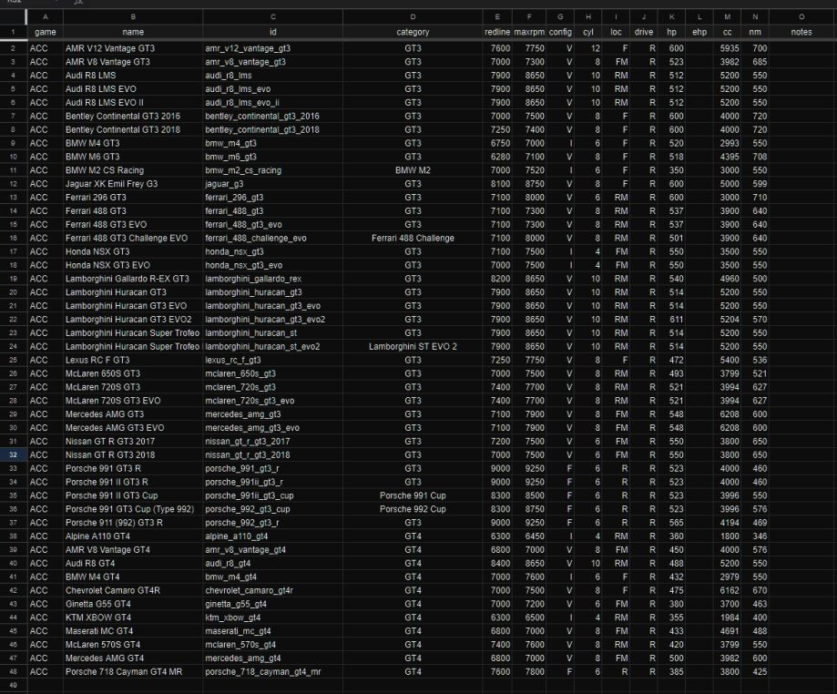

# SimHap  
- decompiled by @**dMASS** from @**sierses**' `.dll`   
- decompiled `SimHap.csproj` hacked for SimHub plugin compatibility by @**blekelbleu**  
- [initial build errors](Doc/error1.txt)  
- [JToken.explicit build errors](Doc/error2.txt) after others addressed
- `namespace` renamed from `SimHaptics` to `sierses.SimHap`  
	- **Note**:  Visual Studio builds .cs files in `obj/` from `.xaml` using e.g.  
      `<UserControl x:Class="sierses.SimHap.SettingsControl"`
		- which must match (renamed) namespace...
### Done
-  blank engine data;&nbsp; *was*:  
	  
	*now*:  
	  
	- caused by wrong fix for [build errors](Doc/message.txt)  
	- *14 May 2024*:&nbsp;  eliminated `SettingsControl.xaml.cs` stripping for missing engine data
		- `Untoken()` replaced disallowed `JToken.op_Explicit(jtoken[(object) "name"])` 
### To Do (or at least consider)
- lookup in .json for Internet fails
	- For unknown id, plugin presents users with list of known names not already mapped.  
	When users select a name, the new carID gets added to JSON for that name with old carID.
	  
	*carID is columnC*
### New to me
- [async](https://learn.microsoft.com/en-us/dotnet/csharp/asynchronous-programming/async-scenarios)
- [Dictionary](https://stackoverflow.com/questions/4245064/method-to-add-new-or-update-existing-item-in-c-sharp-dictionary)
### How it works
- with game running: `DataUpdate()`
	- `SetVehiclePerGame()` based on time
		- better done by event...
		- calls `FetchCarData()`
	- update physics:
		- Yaw, YawRate, YawRateAvg
		- AccHeave, AccSurge, AccSway, Jerk[XYZ]
		- MotionPitch, MotionRoll, MotionYaw, MotionHeave
		- WheelLoads, Slips, Gear, ABS
		- Suspension, EngineLoad
- End()
	- fiddle with Settings Dictionaries
	- update Settings.Motion from D.Motion

- Init()
	- new Spec(), SimData()
	- SetGame()
	- Load and hack Settings
	- initialize SimData
	- AttachDelegate Spec, SimData
	
