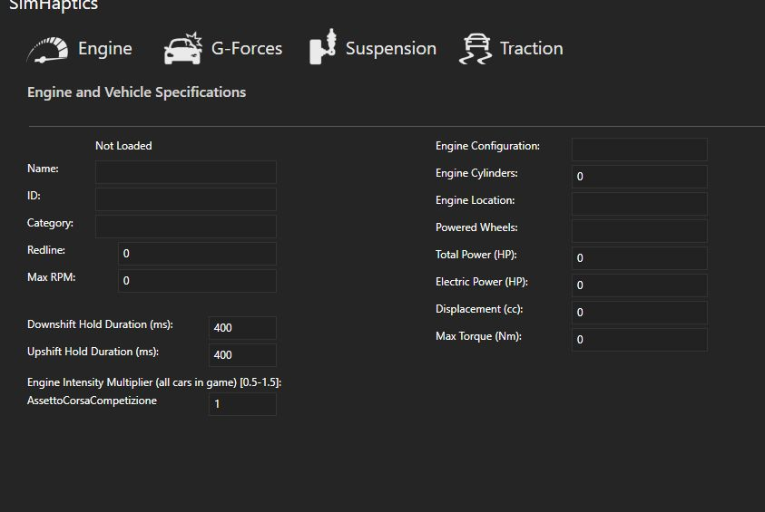
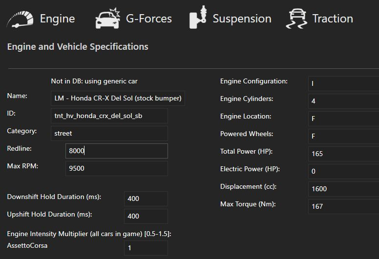

# Haptics  
- decompiled by @**dMASS** from @**sierses**' `.dll`   
- decompiled `Haptics.csproj` hacked for SimHub plugin compatibility by @**blekenbleu**  
- [initial build errors](Doc/error1.txt)  
- [JToken.explicit build errors](Doc/error2.txt) after others addressed
- `namespace` renamed from `SimHaptics` to `sierses.Sim`  
	- **Note**:  Visual Studio builds .cs files in `obj/` from `.xaml` using e.g.  
      `<UserControl x:Class="sierses.Sim.SettingsControl"`
		- which must match (renamed) namespace...
### Done
-  blank engine data;&nbsp; *was*:  
	  
	*now*:  
	  
	- caused by wrong fix for [build errors](Doc/message.txt)  
	- *14 May 2024*:&nbsp;  eliminated `SettingsControl.xaml.cs` stripping for missing engine data
		- `Untoken()` replaced disallowed `JToken.op_Explicit(jtoken[(object) "name"])` 
### New to me
- [async](https://learn.microsoft.com/en-us/dotnet/csharp/asynchronous-programming/async-scenarios)
- [Dictionary](https://stackoverflow.com/questions/4245064/method-to-add-new-or-update-existing-item-in-c-sharp-dictionary)
### How it works
- with game running: `DataUpdate()`
	- update physics:	// provide that loaded id == requested
		- Yaw, YawRate, YawRateAvg
		- AccHeave, AccSurge, AccSway, Jerk[XYZ]
		- MotionPitch, MotionRoll, MotionYaw, MotionHeave
		- WheelLoads, Slips, Gear, ABS
		- Suspension, EngineLoad
		- Haptics based on engine RPM
	- `SetCar()`, when loaded CarId `!=` SimHub's current
		- check local JSON dictionaries
			- read/write personal
			- optional read/only Atlas
		- call `FetchCarData()` for dictionary misses
			- `async await` causes `FetchCarData()`  
				to *not complete* during initial invocation, sets `Waiting`,   
				- successful completion when valid Download object received.   
		- call SetDefaultVehicle() *after* `FetchCarData()` fails
			- e.g. by timeout or invalid Download object`
			- last gasp option:  try matching CarName instead of CarId (particularly for RRRE)
			- UI has a Refresh button to try again
- End()
	- remove some defaults from Settings Dictionaries
	- update Settings.Motion from D.Motion

- Init()
	- new Spec(), SimData()
	- SetGame()
	- Load and hack Settings
	- initialize SimData
	- AttachDelegate Spec, SimData

- UI
	- Motion, Suspension and Traction settings are saved in Settings Dictionaries
		- Only one set of Motion properties, all in a single Dictionary
		- Suspension and Traction have per-game dictionaries
	- Engine specs are loaded or defaulted

### changes
- consolidate `SimData` methods in that source file
- likewise for `Spec`
- created a `ListDictionary` class for download server compatibility
- read, write local json e.g. to preserve changed values
- first lookup in .json, then Internet for fails, then defaults - *Done 27 May 2024*
- reworked `IdleRPM` handling, perhaps not for the better.. 
- write json when values change - *20 May 2024*: coded  
- improve performance and simplify code - *22 May 2024*: in progress  
- share `CarSpec` class between `Spec` and `SimData` - *21 May 2024*: done  
	 to save storage and eliminate copying
- for `FetchCarData()`	 &nbsp; - &nbsp; *Done 27 May*
	- remove `S.Car` as an argument; it is always used
	- delay setting `S.Id` until `false == Waiting` 
- add another Spec entry, indicating cars from `Defaults()`, preserving that heritage. - *done 28 May 2024*
- sort IdleRPM issues - e.g. not matching JSON value - *fixed 29 May*  
- paradigm shift for `Loaded`:  *done 29 May*
	- originally intended for `FetchCarData()` success, extended for saving to JSON
	- extended to include `Defaults()`...   
      // but no reason to save easily-regenerated `Defaults()` to JSON...  
		- *instead*,  keep the `new CarSpec` generated by `Defaults()`  
          until `DataUpdate()` invokes `S.Add(S.Id)`  
			- save current `S.Car` *only if changed* from `Defaults()`  
			- ignore `idlerpm` change (from 0 by sniffing)
- read-only Atlas of cars.	*done 30 May*
- add Log messages to sort issues	*23 May*
	- track `async await` sequence
- debug loading a default car after a server car or JSON car or vice-versa *30 May*
- add a reference catalog lookup, for `PluginsData/Catalog.Haptics.json`,  *30 May*  
	for cars *not* in personal JSON..  
	That catalog would NOT get overwritten,  
    preventing user cars from contaminating it.
- save `FetchCarData()` or modified `Defaults()`  *29 May*
- `Refresh()` only if `EngineIgnitionOn` *30 May*  
- **refactoring**
	- when SimHub invokes `DataUpdate()` (at 60 Hz),
		- avoid invoking either `Refresh()` or `SetCar()` if `Waiting`
	- when `static async void FetchCarData()` eventually gets valid `Download dljc`,
		- to preclude looping, set `Loaded`, unset `Waiting`  
		then immediately return if/when recalled with `null != dljc`

### to do
- generate haptics harmonics and fundamental  
	- export as properties for ShakeIt plugin
- UI support for harmonics settings
- For unknown CarId, present users with list of known similar Car names.  
	- When users select an existing name, apply that car's Spec entries.
- have UI entries affect properties
- check XAML data bindings
- free RAM in `Init` by discarding all but the current game dictionary after initial loading,  
  then reloading in `End()` *only* to save changes.

### asynchronous `FetchCarData()` events and `DataUpdate()` states - *27 May 2024*
- sorting xaml Bindings got boring
- adding lots of log messages helps understand car Spec load events
- `FetchCarData()` events are identified by: &nbsp; booleans `Waiting`, `Loaded`,  
	variables `djlc`, `dls`, 
- `DataUpdate()` states are defined by
	- booleans `Waiting` and `Loaded`, and integer `Index`  
	- variables `data.NewData`, `data.NewData.CarId`, `S.Id`, `LoadFailCount`, `CarInitCount`
- in theory, a *very large* event state space, then...  
	- incrementally, *conditionally disable* log messages for *expected events*

`Init()` sets `Index = 2`, giving priority to .json for car changes  
When SimHub calls `DataUpdate()`:  
if (`null == data.NewData`), then return  
else if (`data.NewData.CarId == S.Id`), then try to `Refresh()` before returning  
else if (`-1 != D.Index`), then proceed to `Add()` and `SetCar()`  
else if (`Waiting && 20 > D.CarInitCount`), then return  
else if (`null != dljc || -3 == Index)`), then proceed to `Add()` and `SetCar()`  
else set `D.CarInitCount = 0`, and if (`3 > LoadFailCount++`), then return  
else lock out `FetchCarData()` by `Index = -3` and continue to `Add()` and `SetCar()`

- to prevent being recalled while waiting for server response,  
    `async FetchCarData()` immediately returns if called when `null != dljc || -1 != Index`  
		else sets `Waiting = true` and invokes `async = await client.GetAsync(requestUri);`
	- on receipt of server response, `FetchCarData()` set `Waiting = false` 
    	- if a valid `Download`, set `Loaded = true`
		- else set `Index = -3`, preventing further attempts
- if (`-2 == Index)`,  `SetCar()` *first* tries getting car Spec from JSON, based on `Index >= 0`  
- failed JSON sets `Index = -1`, enabling `FetchCarData()`,   
    which typically sets `Waiting = true` and goes async.  
- *subsequent* `SetCar()` again checks for `null != dljc || -3 == Index`
	else eventually setting `Index = -3` and `Waiting = false` for `3 <= Haptics.LoadFailCount`  
- if (`-3 == Index` ), then `Defaults()`  
- consequently, server car Specs are associated with `-1 == Index && !Waiting` 
- `Defaults()` attempts to generate game-specific car `Spec`...  
- `SetCar` depends on noting that `current_car != requested_car`  
- however, SimHub's 60Hz `DataUpdate()` can (and does) make calls  
  when `FetchCarData()` eventually matches `requested_car`,  
     car `Spec` code has not completed dotting I's and crossing T's....  
	 consequently, setting current CarId to SimHub's is *near the end* of `SetCar()`  
	- *after* all I's are dotted and Ts are crossed.  
- if `Loaded`, then `SaveCar()` current car `Spec` to current game list
	- *just before* looking for *another* `SetCar()`
	- or during `Exit()` if `Loaded || Save`

### 3 Sep 2024 `CarId` refactor
- `data.NewData.CarId` is not *always* used for indexing dictionaries
- for online database queries, update may not complete for several `DataUpdate()` invocations  
Consequently, a value being stored for testing CarId changes
should be separate from that used for dictionary indexing.
- add `SimHap.cs CarId` to compare for `data.NewData.CarId`
- add `Spec.cs CarId()` to set `Private_Car.id` before other `Private_Car` values may be available
- convert from `data.NewData.CarId` to dictionary index, using `CarId()`, in only one place
- access `Car.id`  instead of passing string arguments with value of `Private_Car.id`.
	- change `Add(string cId)` to `AddCar()` 
	- change `Set(H.N.CarId)` to `SetCar()`
	- change `SelectCar(CarId)` to `SelectCar()`
	- change `FetchCarData(CarId, category, redline, maxRPM, IdleRPM)`  
			to `FetchCarData(category, redline, maxRPM, IdleRPM)`
	- extract RRRE CarId number before comma for indexing
- consolidate SimData class references to `PluginManager` instance
	- change `Refresh(this)` to `Refresh(this, pluginManager)`
- remove untested code for GPBikes, MXBikes
